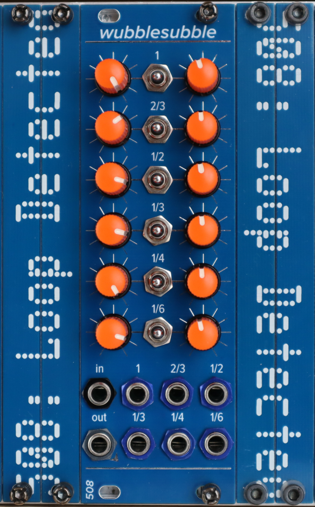

# wubblesubble

A subharmonic oscillator with CV control over the mix. There is one audio input -- takes in the signal from a VCO. There is one audio output, which outputs the mix of some/all of the subharmonics with the original. There are six CV inputs which provide CV control over the mix. 

The channels are, from top to bottom:
 - original input signal
 - square wave a fifth below original
 - square wave an octave below original
 - square wave a fifth plus an octave below original
 - square wave two octaves below original
 - square wave a fifth plus two octaves below original

The pots in the left column provide manual control over the amount of each of the above in the mix. The pots in the right column control the amount of CV influence over that channel's presence in the mix. 

The switches control low-pass filters -- up for a moderate amount of filtration, down for more, middle for none.

Trimming:
 - VR1 is for setting 5V -- check it at the test point labeled 5V
 - VR2 is for tuning the built-in oscillator -- if you don't plug anything in to the input, the wubblesubble will drone. Turn all of the pots all the way left, except for the upper left. Adjust VR2 until you have whatever note at the output you want. If you want to perform Terry Riley's "In C," for example, tune to C :) 

On the back of the module, next to the power, there is a header for a jumper. You must have a jumper on either the left 2 or the right 2 pins. If you have it on the left 2 (labeled "mod," it's hard to read, sorry) then the output is normalled to all the CV inputs, meaning it will self-modulate if you turn up the CV pots with nothing plugged in to the CV inputs. If you have it on the right 2 (labeled "no") then the CV inputs are just grounded when there's nothing plugged in.

This module, like many of my modules, uses 2mm-pitch male/female headers. Be sure you order/use the right thing!

Most ICs are SOIC 8/14/16; all passives are 0805. The BOMs prefixed with `fixed` are easier to read; the others can be used along with the Pick-and-place and gerber files to order PCBs.

The input section using a 4093 to double the frequency of the input waveform is shamelessly borrowed, as most great Eurorack DIY things are, from Ken Stone. 

Here's a link to a short demo video: https://youtu.be/ApMAgQODknw
